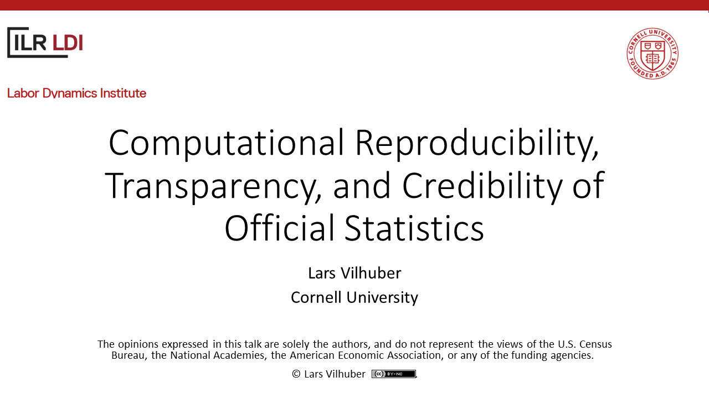

# Computational Reproducibility, Transparency, and Credibility of Official Statistics 

Author: Lars Vilhuber,  https://orcid.org/0000-0001-5733-8932

Presentation at JSM 2020 in Session "Transparent, Efficient and Accessible Reporting on the Quality of Multiple Input Data Sources"

> The opinions expressed in this talk are solely the authors, and do not represent the views of the U.S. Census Bureau, the National Academies, the American Economic Association, or any of the funding agencies. 

Other presentations from the same session:

- Maggie Levenstein's slides: [http://hdl.handle.net/2027.42/156083](http://hdl.handle.net/2027.42/156083)
- Eric Rancourt's slides: [http://doi.org/10.5281/zenodo.3974839](http://doi.org/10.5281/zenodo.3974839)
- John Eltinge's discussion slides: [http://doi.org/10.5281/zenodo.3974847](http://doi.org/10.5281/zenodo.3974847)